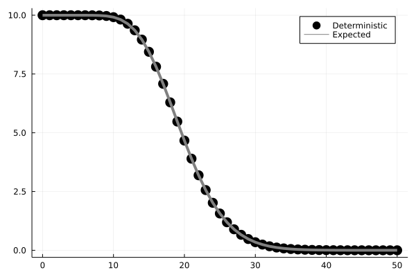
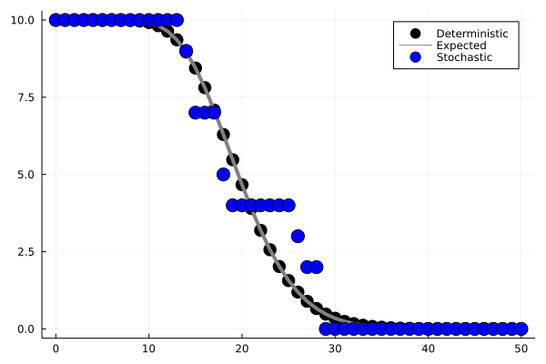
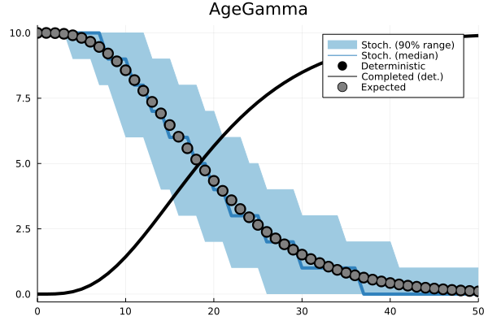
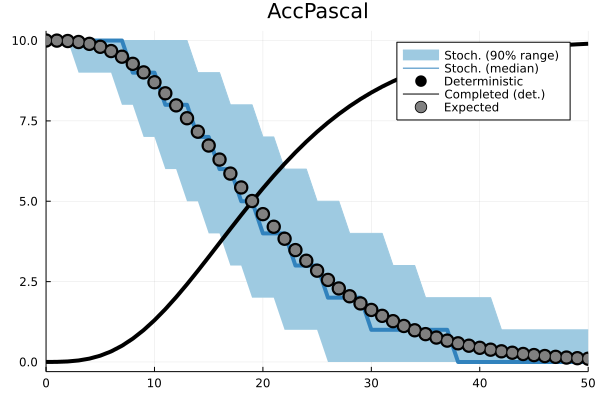
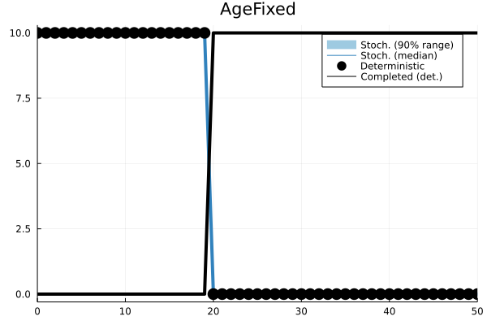
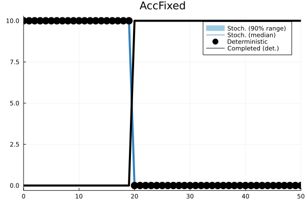
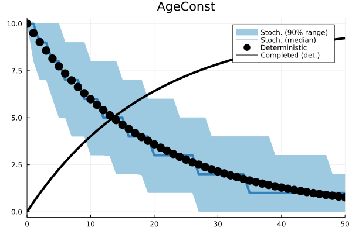
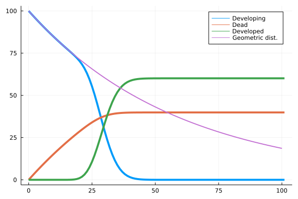
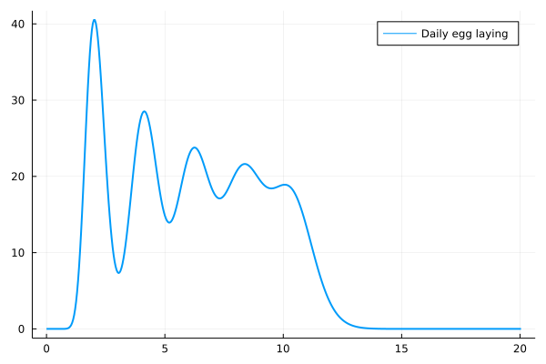

# sPop2.jl


This is the standalone Julia library of the dynamically-structured matrix population model sPop2. This version implements both age-dependent and accumulative processes.

## Installation

Just type this in Julia:
```julia
    using Pkg
    Pkg.add("sPop2")
```

## Using the library

The following creates a pseudo-structured population with 10 individuals and iterates it one step with 0 mortality and an Erlang-distributed development time of $20\pm5$ steps.

```julia
    pop = Population(PopDataSto())
    AddProcess(pop, AccErlang())

    AddPop(pop, 10)
    pr = (devmn=20.0, devsd=5.0)
    size, completed, poptabledone = StepPop(pop, pr)
```

See section [Usage examples](#usage-examples) for further examples.

## References

* Erguler, K., Mendel, J., Petrić, D.V. et al. A dynamically structured matrix population model for insect life histories observed under variable environmental conditions. Sci Rep 12, 11587 (2022). [link](https://doi.org/10.1038/s41598-022-15806-2)
* Erguler K. sPop: Age-structured discrete-time population dynamics model in C, Python, and R [version 3; peer review: 2 approved]. F1000Research 2020, 7:1220. [link](https://doi.org/10.12688/f1000research.15824.3)

# Usage examples

Let's begin with a canonical example. Arguably, the straightforward way to model insect development is to use an ordinary differential equations system with exponentially distributed transition times.

## A deterministic ODE model of larva development

Let's assume that experimental observations of larva development yielded a round figure of 20 days as average development time. This is usually translated to the differential equations reals as an instantaneous rate of $\alpha=1/20$.

<!---
    using Plots
    using DifferentialEquations

    function develop!(du,u,p,t)
        du[1] = -(1.0/20.0)*u[1]
        du[2] = (1.0/20.0)*u[1]
    end

    u0 = [100.0; 0.0;]
    tspan = (0.0, 100.0)
    prob = ODEProblem(develop!,u0,tspan)
    sol = solve(prob)

    plot(sol,vars=(0,1),lw=4, label="Larva")
-->
```julia
    using DifferentialEquations

    function develop!(du,u,p,t)
        du[1] = -(1.0/20.0)*u[1]
        du[2] = (1.0/20.0)*u[1]
    end

    u0 = [100.0; 0.0;]
    tspan = (0.0, 100.0)
    prob = ODEProblem(develop!,u0,tspan)
    sol = solve(prob)
```


Expectedly, this implies that larvae begin developing by the time they emerge from eggs, and keep producing pupae at the same constant rate until a negligible number of larvae is left.

## A deterministic population with Erlang-distributed accumulative development

An alternative representation with a structured population can be constructed using sPop2. For this, we need to know not the rate of pupa production, but the average duration of the larva stage and its variation. Let's assume that stage duration follows a [gamma](https://en.wikipedia.org/wiki/Gamma_distribution) distribution ([Erlang](https://en.wikipedia.org/wiki/Erlang_distribution) to be precise), which implies that all individuals race to develop out of the larva stage, while some are faster and even more of them are slower.

<!---
    using Plots
    using Distributions

    pop = Population(PopDataDet())

    AddProcess(pop, AccErlang())

    pr1 = (devmn=20.0, devsd=5.0)

    AddPop(pop, 10.0)
    out = [0 10.0 0.0]
    xr = 0:50
    for n in xr[2:end]
        ret = StepPop(pop, pr1)
        out = vcat(out, [n ret[1] ret[2]])
    end

    k, theta, stay = pop.hazards[1].pars(pr1)

    plot(out[:,1], out[:,2], line = :scatter, c="black", ms=8, label="Deterministic")
    plot!(xr, 10.0*(1.0 .- cdf(Gamma(k,theta),xr)), c="gray", lw=4, label="Expected")
-->
```julia
    pop = Population(PopDataDet())
    AddProcess(pop, AccErlang())

    AddPop(pop, 10.0)
    out = [0 10.0 0.0]
    for n in 1:50
        pr1 = (devmn=20.0, devsd=5.0)
        ret = StepPop(pop, pr1)
        out = vcat(out, [n ret[1] ret[2]])
    end
```



## Accounting for stochasticity

With a simple modification, we can simulate how the dynamics vary when each individual is given a daily chance of completing its development based on the Erlang-distributed development time assumption.

<!---
plot!(outst[:,1], outst[:,2], line = :scatter, c="blue", ms=8, label="Stochastic")
-->
```julia
    pop = Population(PopDataSto())
    AddProcess(pop, AccErlang())

    AddPop(pop, 10)
    outst = [0 10 0.0]
    for n in 1:50
        pr1 = (devmn=20.0, devsd=5.0)
        ret = StepPop(pop, pr1)
        outst = vcat(outst, [n ret[1] ret[2]])
    end
```



## Distributions and assumptions

sPop2 allows for [age-dependent](https://doi.org/10.12688/f1000research.15824.3) and [accumulative](https://doi.org/10.1038/s41598-022-15806-2) development times.

<!---
N = 10.0
mu = 20.0
mu2 = 20.0
sd = 10.0

xr = 0:50

function simDet(hazard::HazTypes)
    pop = Population(PopDataDet())
    AddProcess(pop, hazard)
    AddPop(pop, N)
    retd = [0 N 0.0]
    for n in xr[2:end]
        pr1 = typeof(hazard) <: AgeConst ? (prob=(mu != mu2 && n > 20) ? 1.0/mu2 : 1.0/mu,) : (devmn=(mu != mu2 && n > 20) ? mu2 : mu, devsd=sd)
        ret = StepPop(pop, pr1)
        retd = vcat(retd, [n ret[1] ret[2]])
    end
    return retd
end

function simStoch(hazard::HazTypes)
    pop = Population(PopDataSto())
    AddProcess(pop, hazard)
    rets = []
    for r in 1:1000
        AddPop(pop, Int64(N))
        ret = [Int64(N)]
        for n in xr[2:end]
            pr1 = typeof(hazard) <: AgeConst ? (prob=(mu != mu2 && n > 20) ? 1.0/mu2 : 1.0/mu,) : (devmn=(mu != mu2 && n > 20) ? mu2 : mu, devsd=sd)
            sz = StepPop(pop, pr1)
            push!(ret, sz[1])
        end
        if rets == []
            rets = ret
        else
            rets = cat(rets,ret,dims=2)
        end
        EmptyPop(pop)
    end
    res = []
    for r in 1:size(rets)[1]
        p = quantile(rets[r,:],[0.05,0.5,0.95])
        if res == []
            res = p
        else
            res = hcat(res, p)
        end
    end
    return hcat(xr,transpose(res))
end

hazards = ["AccErlang", "AccPascal", "AccFixed", "AgeFixed", "AgeConst", "AgeGamma", "AgeNbinom"]
for hazard in hazards
    if hazard == "AccErlang"
        hz = AccErlang()
        pr1 = (devmn=mu,devsd=sd)
    elseif hazard == "AccPascal"
        hz = AccPascal()
        pr1 = (devmn=mu,devsd=sd)
    elseif hazard == "AccFixed"
        hz = AccFixed()
        pr1 = (devmn=mu,devsd=sd)
    elseif hazard == "AgeFixed"
        hz = AgeFixed()
        pr1 = (devmn=mu,devsd=sd)
    elseif hazard == "AgeConst"
        hz = AgeConst()
        pr1 = (prob=1.0/mu,)
    elseif hazard == "AgeGamma"
        hz = AgeGamma()
        pr1 = (devmn=mu,devsd=sd)
    elseif hazard == "AgeNbinom"
        hz = AgeNbinom()
        pr1 = (devmn=mu,devsd=sd)
    end
    out_det = simDet(hz)
    out_sto = simStoch(hz)
    k, theta, stay = hz.pars(pr1)
    plt = plot(out_sto[:,1], out_sto[:,4], fillrange = out_sto[:,2], title=hazard, c="#9ecae1", label="Stoch. (90% range)")
    plot!(out_sto[:,1], out_sto[:,3], lw=4, c="#3182bd", label="Stoch. (median)")
    plot!(out_det[:,1], out_det[:,2], line = :scatter, c="black", ms=8, label="Deterministic")
    plot!(out_det[:,1], cumsum(out_det[:,3]), c="black", lw=4, label="Completed (det.)")
    if hazard in ["AccErlang" "AgeGamma"]
        plot!(xr, N*(1.0 .- cdf(Gamma(k,theta),xr)), line= :scatter, c="gray", ms=6, label="Expected")
    elseif hazard in ["AccPascal" "AgeNbinom"]
        plot!(xr, N*(1.0 .- cdf(NegativeBinomial(k,theta),xr .- 1)), line= :scatter, c="gray", ms=6, label="Expected")
    elseif hazard in ["AGE_CONST"]
        plot!(xr, [N*(1.0 .- cdf(Geometric(theta),x-1)) for x in xr], line= :scatter, c="gray", ms=6, label="Expected")
    end
    xlims!(0,50)

    savefig("docs/figures/distr_$(hazard).png")
end
-->

| Process     | Parameters   | Definition    |
| :---        |    :----:    |          ---: |
| AccErlang   | devmn, devsd | Erlang-distributed accumulative process   |
| AccPascal   | devmn, devsd | Pascal-distributed accumulative process   |
| AccFixed    | devmn | Fixed-duration accumulative process   |
| AgeFixed   | devmn | Pascal-distributed age-dependent process   |
| AgeConst   | prob | Constant-rate age-dependent process   |
| AgeGamma   | devmn, devsd | Gamma-distributed age-dependent process   |
| AgeNbinom   | devmn, devsd | Negative binomial-distributed age-dependent process   |

| Age-dependent | Accumulative |
| :---        |    ---: |
|  |  |
|  |  |
|  |  |
|  |  |

## Combining multiple processes

Multiple processes can be added to a _Population_ to represent more complex dynamics. For instance, we can represent survival with a daily constant rate and development with an Erlang-distributed accumulative process. The processes are executed in the order they are added to the _Population_.

<!---
a = Population(PopDataDet())
AddProcess(a, AgeConst(), AccErlang())
AddPop(a,100.0)
ret = [0 GetPop(a) 0.0 0.0]
for i in 0:100
    pr1 = (prob=1.0/60.0,)
    pr2 = (devmn=30.0, devsd=5.0)
    out = StepPop(a, pr1, pr2)
    ret = vcat(ret, [i+1 out[1] out[2][1] out[2][2]])
end

xr = 0:100
plot(ret[:,1],ret[:,2],lw=4,label="Developing")
plot!(ret[:,1],cumsum(ret[:,3]),lw=4,label="Dead")
plot!(ret[:,1],cumsum(ret[:,4]),lw=4,label="Developed")
plot!(xr,[100.0*(1 .- cdf(Geometric(1.0/60.0),x-1)) for x in xr], lw=2, label="Geometric dist.")
-->

```julia
a = Population(PopDataDet())
AddProcess(a, AgeConst(), AccErlang())
AddPop(a, 100.0)
ret = [0 GetPop(a) 0.0 0.0]
for i in 0:100
    pr1 = (prob=1.0/60.0,)
    pr2 = (devmn=30.0, devsd=5.0)
    out = StepPop(a, pr1, pr2)
    ret = vcat(ret, [i+1 out[1] out[2][1] out[2][2]])
end
```

The above instruction represent a life stage with $0.017$ daily mortality and $30\pm5$ days of development time.



## Gonotrophic cycle with a negative impact of ovipositioning

In this section, we will attempt to reproduce [Figure 1](https://f1000research.com/articles/7-1220#f1) in the original age-dependent [sPop](https://doi.org/10.12688/f1000research.15824.3) model. We will represent an adult female mosquito with a lifetime of $20\pm2$ days. The female enters a cyclic process of obtaining bloodmeal and egg development, which takes about $2$ days. However, at the end of each ovipositioning, her expected lifetime decreases by $2$ days. I assure you that the actual physiology is far more complicated than this!

In order to represent the lifetime of this female mosquito, we will employ $3$ processes:

 * A custom age- and ovipositioning-dependent mortality process
 * An age-dependent gamma-distributed egg development process
 * A dummy process to count the number of ovipositioning events

```julia
    # Declare a population with deterministic dynamics
    a = Population(PopDataDet())
    # Define three processes in this order: Mortality, Gonotropic cycle, Ovipositioning
    AddProcess(a, AgeCustom(custom, AgeStepper), AgeGamma(), AgeDummy())
```

The $3^{rd}$ process is a dummy (_AgeDummy_), which does not affect the population or even does not posess a time counter. The $2^{nd}$ process is the regular age-dependent gamma-distributed development process (_AgeGamma_).

The mortality process, on the other hand, is defined with a _custom_ function and uses the _AgeStepper_. We included this stepper in process declaration, because we require that the status indicator be an age counter, _i.e._ the number of steps the _Population_ is iterated is kept in the status indicator (see _qkey_ below). We declare the _custom_ function as the following.

```julia
function custom(heval::Function, d::Number, q::Number, k::Number, theta::Number, qkey::Tuple)
    devmn = 480.0 - (qkey[3] > 4 ? 240.0 : 48.0 * qkey[3])
    devsd = 0.1 * devmn
    pr = (devmn=devmn, devsd=devsd)
    k, theta, stay = sPop2.age_gamma_pars(pr)
    return sPop2.age_hazard_calc(sPop2.age_gamma_haz, 0, qkey[1], k, theta, qkey)
end
```

With this function, we override an internal mechanism used by all other processes to calculate the probability of exit (need this be due to mortality, development, or something else) from the _Population_. This generic functional form takes the following parameters.

 - _heval_ is a function to calculate the cumulative probability density of an exit event. It may use some of the other parameters to do so.
 - _d_ refers to the number of days (more correctly time steps) elapsed in _Population_.
 - _q_ refers to the fraction of development (used in accumulative processes).
 - _k_ and _theta_ are the parameters of the stage duration (development time) distribution.
 - _qkey_ is a tuple of status indicators (age for age-dependent and development fraction for accumulative processes)

 Of all these, we use the status indicators to calculate the mean and standard deviation of mortality based on the third (_dummy_) process. 

```julia
    devmn = 480.0 - (qkey[3] > 4 ? 240.0 : 48.0 * qkey[3]) # qkey[3]: Ovipositioning
    devsd = 0.1 * devmn
    pr = (devmn=devmn, devsd=devsd)
```

Then, we calculate the parameters of the corresponding gamma distribution using the internal function
```julia
    k, theta, stay = sPop2.age_gamma_pars(pr)
```
and, with these, we calculate the cumulative probability of daily mortality
```julia
    sPop2.age_hazard_calc(sPop2.age_gamma_haz, 0, qkey[1], k, theta, qkey) # qkey[1]: Mortality
```

Overall, the script to model the dynamics is given below.

<!---
function custom(heval::Function, d::Number, q::Number, k::Number, theta::Number, qkey::Tuple)
    devmn = 480.0 - (qkey[3] > 4 ? 240.0 : 48.0 * qkey[3])
    devsd = 0.1 * devmn
    pr = (devmn=devmn, devsd=devsd)
    k, theta, stay = sPop2.age_gamma_pars(pr)
    return sPop2.age_hazard_calc(sPop2.age_gamma_haz, 0, qkey[1], k, theta, qkey)
end

function SimDet()
    a = Population(PopDataDet())
    # Mortality, Gonotropic cycle, Ovipositioning
    AddProcess(a, AgeCustom(custom,AgeStepper), AgeGamma(), AgeDummy())
    AddPop(a,1000.0)
    ret = [0 0.0]
    for i in 0:480
        pr1 = NamedTuple{}()
        pr2 = (devmn=50.0, devsd=10.0)
        out = StepPop(a, pr1, pr2, pr1)
        for (q,n) in out[3][2]
            AddPop(a, n, q.key[1], 0, q.key[3]+one(q.key[3]))
        end
        ret = vcat(ret, [i+1 out[2][2]])
    end
    return ret
end

retd = SimDet()

plot(retd[:,1]/24.0,retd[:,2], lw=2, label="Daily egg laying")
-->
```julia
    function custom(heval::Function, d::Number, q::Number, k::Number, theta::Number, qkey::Tuple)
        devmn = 480.0 - (qkey[3] > 4 ? 240.0 : 48.0 * qkey[3])
        devsd = 0.1 * devmn
        pr = (devmn=devmn, devsd=devsd)
        k, theta, stay = sPop2.age_gamma_pars(pr)
        return sPop2.age_hazard_calc(sPop2.age_gamma_haz, 0, qkey[1], k, theta, qkey)
    end

    a = Population(PopDataDet())
    # Mortality, Gonotropic cycle, Ovipositioning
    AddProcess(a, AgeCustom(custom, AgeStepper), AgeGamma(), AgeDummy())
    AddPop(a,1000.0)
    ret = [0 0.0]
    for i in 0:480
        pr1 = NamedTuple{}()
        pr2 = (devmn=50.0, devsd=10.0)
        out = StepPop(a, pr1, pr2, pr1)
        for (q,n) in out[3][2]
            # Please note that this step is essential!
            AddPop(a, n, q.key[1], 0, q.key[3]+one(q.key[3]))
        end
        ret = vcat(ret, [i+1 out[2][2]])
    end
    return ret

```

At each step, _StepPop_ returns the following tuple

- Current size off the population.
- Number of individuals completing each process in the given order.
- An array of (status indicators - number of individuals) pairs for each process.

The script adds all individuals completing a gonotrophic cycle (_out[3][2]_) back to the _Population_ one by one. While doing so, their status indicators are updated manually.

- _n_ individuals are added
- Mortality indicator is left unchanged (_q.key[1]_)
- Egg development indicator is reset
- Ovipositioning indicator is incremented (_q.key[3] + one(q.key[3])_)


