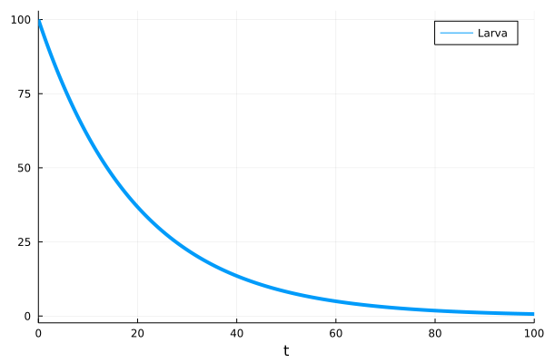

# sPop2.jl


This is the standalone Julia library of the dynamically-structured matrix population model sPop2. This version implements both age-dependent and accumulative processes.

## Installation

Just type this in Julia:
```julia
    using Pkg
    Pkg.add("sPop2")
```

## Using the library

The following creates a pseudo-structured population with 10 individuals and iterates it one step with 0 mortality and an Erlang-distributed development time of 20&pm;5 steps.

```julia
    pop = Population(PopDataSto())
    AddProcess(pop, AccErlang())

    AddPop(pop, 10)
    pr = (devmn=20.0, devsd=5.0)
    size, completed, poptabledone = StepPop(pop, pr)
```

See section [Usage examples](#usage-examples) for further examples.

## References

* Erguler, K., Mendel, J., Petrić, D.V. et al. A dynamically structured matrix population model for insect life histories observed under variable environmental conditions. Sci Rep 12, 11587 (2022). [link](https://doi.org/10.1038/s41598-022-15806-2)
* Erguler K. sPop: Age-structured discrete-time population dynamics model in C, Python, and R [version 3; peer review: 2 approved]. F1000Research 2020, 7:1220. [link](https://doi.org/10.12688/f1000research.15824.3)

# Usage examples

Let's begin with a canonical example. Arguably, the straightforward way to model insect development is to use an ordinary differential equations system with exponentially distributed transition times.

## A deterministic ODE model of larva development

Let's assume that experimental observations of larva development yielded a round figure of 20 days as average development time. This is usually translated to the differential equations reals as an instantaneous rate of $\alpha=1/20$.

<!---
    using Plots
    using DifferentialEquations

    function develop!(du,u,p,t)
        du[1] = -(1.0/20.0)*u[1]
        du[2] = (1.0/20.0)*u[1]
    end

    u0 = [100.0; 0.0;]
    tspan = (0.0, 100.0)
    prob = ODEProblem(develop!,u0,tspan)
    sol = solve(prob)

    plot(sol,vars=(0,1),lw=4, label="Larva")
-->
```julia
    using DifferentialEquations

    function develop!(du,u,p,t)
        du[1] = -(1.0/20.0)*u[1]
        du[2] = (1.0/20.0)*u[1]
    end

    u0 = [100.0; 0.0;]
    tspan = (0.0, 100.0)
    prob = ODEProblem(develop!,u0,tspan)
    sol = solve(prob)
```



Expectedly, this implies that larvae begin developing by the time they emerge from eggs, and keep producing pupae at the same constant rate until a negligible number of larvae is left.

## A deterministic population with Erlang-distributed accumulative development

An alternative representation with a structured population can be constructed using sPop2. 

<!---
    using Plots
    using Distributions

    pop = Population(PopDataDet())

    AddProcess(pop, AccErlang())

    pr1 = (devmn=20.0, devsd=5.0)

    AddPop(pop, 100.0)
    out = [0 100.0 0.0]
    xr = 0:50
    for n in xr[2:end]
        ret = StepPop(pop, pr1)
        out = vcat(out, [n ret[1] ret[2]])
    end

    k, theta, stay = pop.hazards[1].pars(pr1)

    plot(out[:,1], out[:,2], line = :scatter, c="black", ms=8, label="Deterministic")
    plot!(xr, 100.0*(1.0 .- cdf(Gamma(k,theta),xr)), c="gray", lw=4, label="Expected")
-->
```julia
    pop = Population(PopDataDet())
    AddProcess(pop, AccErlang())

    AddPop(pop, 100.0)
    out = [0 100.0 0.0]
    for n in 1:50
        pr1 = (devmn=20.0, devsd=5.0)
        ret = StepPop(pop, pr1)
        out = vcat(out, [n ret[1] ret[2]])
    end
```

